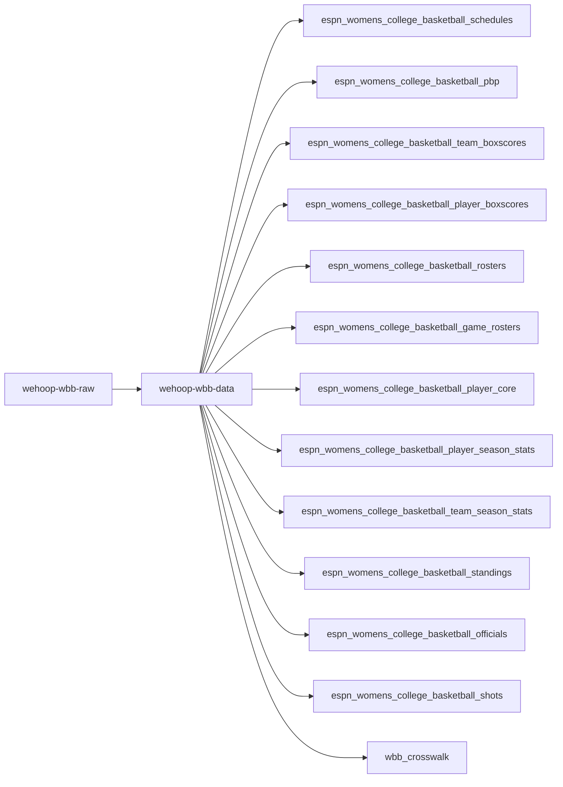
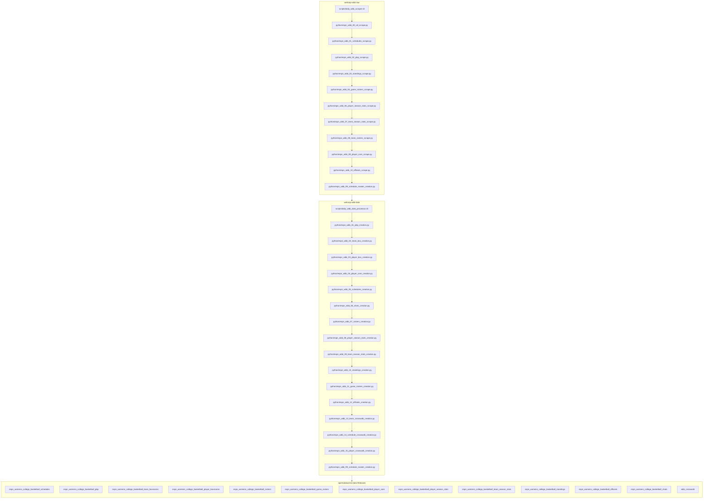

# wehoop-wbb-raw

## wehoop ESPN WBB workflow diagram





`scripts/daily_wbb_scraper.sh` and `scripts/daily_wbb_data_processor.sh` are the
daily drivers (the `00` role); stage numbers are intended build order, not run order.
On the raw side `05` (draft) is WNBA-only and intentionally vacant;
`espn_wbb_00_all_scrape.py` sweeps every stage in one call.

[wehoop-wbb-raw repository (source: ESPN)](https://github.com/sportsdataverse/wehoop-wbb-raw)

[wehoop-wbb-data repository (source: ESPN)](https://github.com/sportsdataverse/wehoop-wbb-data)

[wehoop-wnba-raw repository (source: ESPN)](https://github.com/sportsdataverse/wehoop-wnba-raw)

[wehoop-wnba-data repository (source: ESPN)](https://github.com/sportsdataverse/wehoop-wnba-data)

[wehoop-wnba-stats-raw repository (source: WNBA Stats)](https://github.com/sportsdataverse/wehoop-wnba-stats-raw)

[wehoop-wnba-stats-data repository (source: WNBA Stats)](https://github.com/sportsdataverse/wehoop-wnba-stats-data)

[ncaa-wbb-hoops-raw repository (source: stats.ncaa.org)](https://github.com/sportsdataverse/ncaa-wbb-hoops-raw)

[ncaa-wbb-hoops-data repository (source: stats.ncaa.org)](https://github.com/sportsdataverse/ncaa-wbb-hoops-data)

## Pipeline

Script numbers are the **ecosystem-wide dataset identity**, not a strict
execution sequence: `NN` means the same dataset in every ESPN `-raw` repo
(nba / mbb / wnba / wbb) — 01 schedules, 02 pbp, 03 standings, 04 game_rosters,
05 draft, 06 player_stats, 07 team_stats, 08 team_rosters, 09 player_core,
10+ league extras, 99 master. `05` is an intentional hole here (no WBB draft);
holes are preserved rather than compacted so a number never means two things.
Execution order lives in `python/espn_wbb_00_all_scrape.py` and
`scripts/daily_wbb_scraper.sh` — the real dependencies are `01` before `02`
(the schedule enumerates games) and `99` last (it unions the per-season files);
the middle stages are independent, so the driver does not run strictly
ascending (the nba/mbb/wnba drivers don't either).

Numbers are **per-repo-family**: `wehoop-wbb-data`'s `espn_wbb_NN_*_creation.R`
stages have their own build-order numbering and do NOT correspond to these.

This repo publishes **no release tags**; it is the archive.
Release tags are published by
[`wehoop-wbb-data`](https://github.com/sportsdataverse/wehoop-wbb-data).

| # | Script | Raw tree written | Feeds the `-data` dataset |
|---:|---|---|---|
| 01 | `python/espn_wbb_01_schedules_scrape.py` | `wbb/schedules/{parquet,rds}/` | `schedules` |
| 02 | `python/espn_wbb_02_pbp_scrape.py` | `wbb/json/{raw,final}/` | `pbp`, `team_box`, `player_box`, `shots` |
| 03 | `python/espn_wbb_08_team_rosters_scrape.py` | `wbb/team_rosters/json/` | `rosters` |
| 04 | `python/espn_wbb_09_player_core_scrape.py` | `wbb/player_core/json/` | `player_core` |
| 05 | `python/espn_wbb_06_player_season_stats_scrape.py` | `wbb/player_season_stats/json/` | `player_season_stats` |
| 06 | `python/espn_wbb_07_team_season_stats_scrape.py` | `wbb/team_stats/json/` | `team_season_stats` |
| 07 | `python/espn_wbb_03_standings_scrape.py` | `wbb/standings/json/` | `standings` |
| 08 | `python/espn_wbb_04_game_rosters_scrape.py` | `wbb/game_rosters/json/` | `game_rosters` |
| 09 | `python/espn_wbb_10_officials_scrape.py` | `wbb/officials/json/` | `officials` |

Run everything for a season:

```sh
bash scripts/daily_wbb_scraper.sh -s 2026 -e 2026
```

`-r` defaults to **false**: payloads already on disk are skipped, because the
raw tree is the scrape checkpoint.

## Women's Basketball Data Releases

[ESPN Women's College Basketball Schedules](https://github.com/sportsdataverse/sportsdataverse-data/releases/tag/espn_womens_college_basketball_schedules)

[ESPN Women's College Basketball PBP](https://github.com/sportsdataverse/sportsdataverse-data/releases/tag/espn_womens_college_basketball_pbp)

[ESPN Women's College Basketball Team Boxscores](https://github.com/sportsdataverse/sportsdataverse-data/releases/tag/espn_womens_college_basketball_team_boxscores)

[ESPN Women's College Basketball Player Boxscores](https://github.com/sportsdataverse/sportsdataverse-data/releases/tag/espn_womens_college_basketball_player_boxscores)

[ESPN WNBA Schedules](https://github.com/sportsdataverse/sportsdataverse-data/releases/tag/espn_wnba_schedules)

[ESPN WNBA PBP](https://github.com/sportsdataverse/sportsdataverse-data/releases/tag/espn_wnba_pbp)

[ESPN WNBA Team Boxscores](https://github.com/sportsdataverse/sportsdataverse-data/releases/tag/espn_wnba_team_boxscores)

[ESPN WNBA Player Boxscores](https://github.com/sportsdataverse/sportsdataverse-data/releases/tag/espn_wnba_player_boxscores)


## Data Repositories

[wehoop-wnba-raw data repository (source: ESPN)](https://github.com/sportsdataverse/wehoop-wnba-raw)

[wehoop-wnba-data repository (source: ESPN)](https://github.com/sportsdataverse/wehoop-wnba-data)

[wehoop-wnba-stats-data Repo (source: NBA Stats)](https://github.com/sportsdataverse/wehoop-wnba-stats-data)

[wehoop-wbb-raw data repository (source: ESPN)](https://github.com/sportsdataverse/wehoop-wbb-raw)

[wehoop-wbb-data repository (source: ESPN)](https://github.com/sportsdataverse/wehoop-wbb-data)

## Reports & explainers

<!-- BEGIN GENERATED: reports -->

| Report | What it is | Last updated |
|---|---|---|
| _none yet_ | — | — |

<!-- END GENERATED: reports -->

## Automation & status

<!-- BEGIN GENERATED: status -->

| workflow | schedule | last run |
|---|---|---|
| [](https://github.com/sportsdataverse/wehoop-wbb-raw/actions/workflows/daily_wbb_raw.yml) | days 18-31 06:30 UTC in Oct; daily 06:30 UTC in Nov-Dec; daily 06:30 UTC in Jan-Apr; days 1-12 06:30 UTC in Apr | 2026-05-07 |
| [](https://github.com/sportsdataverse/wehoop-wbb-raw/actions/workflows/orphan_scripts.yml) | on push / PR / dispatch | 2026-08-24 |
| [](https://github.com/sportsdataverse/wehoop-wbb-raw/actions/workflows/tests.yml) | on push / PR / dispatch | 2026-08-24 |
| [](https://github.com/sportsdataverse/wehoop-wbb-raw/actions/workflows/wehoop_wbb_data_trigger.yaml) | on push / dispatch | 2026-08-24 |

<!-- END GENERATED: status -->
