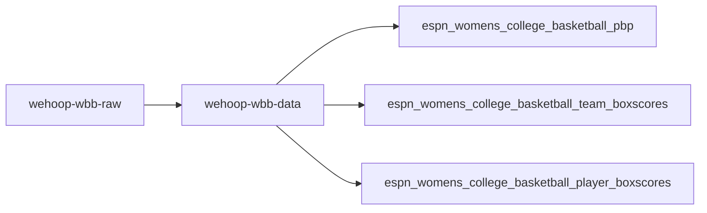
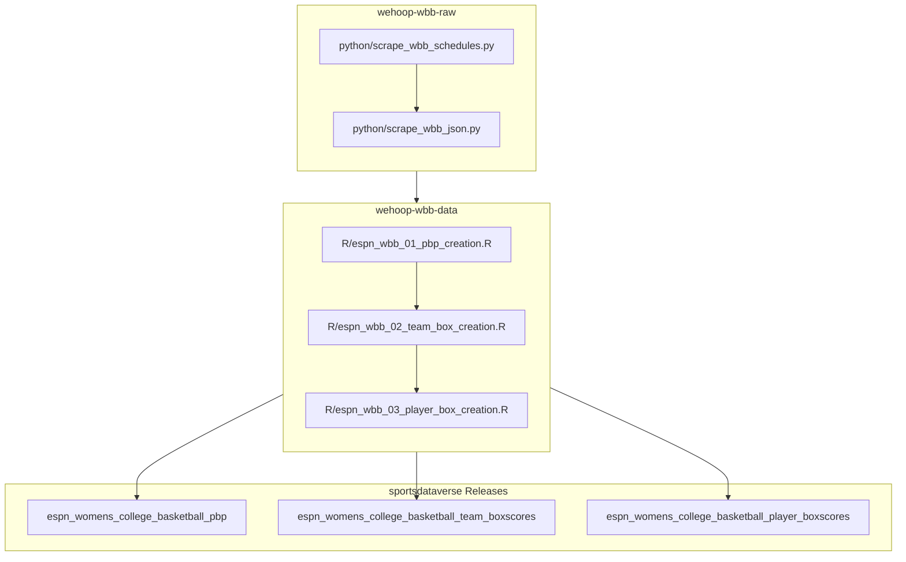

# wehoop-wbb-raw



## wehoop ESPN WBB workflow diagram



## Pipeline

Script numbers are run order — `01` writes the season schedule that `02` reads
to enumerate games. This repo publishes **no release tags**; it is the archive.
Release tags are published by
[`wehoop-wbb-data`](https://github.com/sportsdataverse/wehoop-wbb-data).

| # | Script | Raw tree written | Feeds the `-data` dataset |
|---:|---|---|---|
| 01 | `python/espn_wbb_01_schedules_scrape.py` | `wbb/schedules/{parquet,rds}/` | `schedules` |
| 02 | `python/espn_wbb_02_pbp_scrape.py` | `wbb/json/{raw,final}/` | `pbp`, `team_box`, `player_box`, `shots` |
| 03 | `python/espn_wbb_03_team_rosters_scrape.py` | `wbb/team_rosters/json/` | `rosters` |
| 04 | `python/espn_wbb_04_player_core_scrape.py` | `wbb/player_core/json/` | `player_core` |
| 05 | `python/espn_wbb_05_player_season_stats_scrape.py` | `wbb/player_season_stats/json/` | `player_season_stats` |
| 06 | `python/espn_wbb_06_team_season_stats_scrape.py` | `wbb/team_stats/json/` | `team_season_stats` |
| 07 | `python/espn_wbb_07_standings_scrape.py` | `wbb/standings/json/` | `standings` |
| 08 | `python/espn_wbb_08_game_rosters_scrape.py` | `wbb/game_rosters/json/` | `game_rosters` |
| 09 | `python/espn_wbb_09_officials_scrape.py` | `wbb/officials/json/` | `officials` |

Run everything for a season:

```sh
bash scripts/daily_wbb_scraper.sh -s 2026 -e 2026
```

`-r` defaults to **false**: payloads already on disk are skipped, because the
raw tree is the scrape checkpoint.

## Women's Basketball Data Releases

[ESPN Women's College Basketball Schedules](https://github.com/sportsdataverse/sportsdataverse-data/releases/tag/espn_womens_college_basketball_schedules)

[ESPN Women's College Basketball PBP](https://github.com/sportsdataverse/sportsdataverse-data/releases/tag/espn_womens_college_basketball_pbp)

[ESPN Women's College Basketball Team Boxscores](https://github.com/sportsdataverse/sportsdataverse-data/releases/tag/espn_womens_college_basketball_team_boxscores)

[ESPN Women's College Basketball Player Boxscores](https://github.com/sportsdataverse/sportsdataverse-data/releases/tag/espn_womens_college_basketball_player_boxscores)

[ESPN WNBA Schedules](https://github.com/sportsdataverse/sportsdataverse-data/releases/tag/espn_wnba_schedules)

[ESPN WNBA PBP](https://github.com/sportsdataverse/sportsdataverse-data/releases/tag/espn_wnba_pbp)

[ESPN WNBA Team Boxscores](https://github.com/sportsdataverse/sportsdataverse-data/releases/tag/espn_wnba_team_boxscores)

[ESPN WNBA Player Boxscores](https://github.com/sportsdataverse/sportsdataverse-data/releases/tag/espn_wnba_player_boxscores)


## Data Repositories

[wehoop-wnba-raw data repository (source: ESPN)](https://github.com/sportsdataverse/wehoop-wnba-raw)

[wehoop-wnba-data repository (source: ESPN)](https://github.com/sportsdataverse/wehoop-wnba-data)

[wehoop-wnba-stats-data Repo (source: NBA Stats)](https://github.com/sportsdataverse/wehoop-wnba-stats-data)

[wehoop-wbb-raw data repository (source: ESPN)](https://github.com/sportsdataverse/wehoop-wbb-raw)

[wehoop-wbb-data repository (source: ESPN)](https://github.com/sportsdataverse/wehoop-wbb-data)
